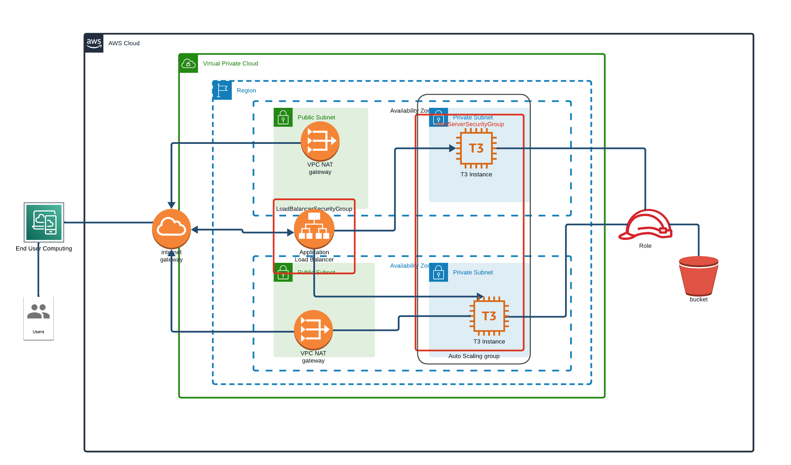

# CloudFormation Stacks Deployment Guide

## Overview

This guide explains how to deploy two AWS CloudFormation stacks:

1. **Network Stack**: Sets up the network infrastructure, including VPC, subnets, and other networking resources.
2. **Udagram Stack**: Creates server resources such as EC2 instances, which depend on the network infrastructure established by the Network Stack.

The deployment of the Udagram Stack must occur after the successful creation of the Network Stack, as it relies on resources created by the Network Stack.

## Below the APP infratructure architecture 




The current deployment is reachable at http://udagra-webap-xkxoi1o1mswu-1937440254.us-east-1.elb.amazonaws.com/

## Prerequisites

- AWS CLI installed and configured with appropriate AWS credentials and default region.
- Basic understanding of AWS CloudFormation and the resources being created.

## About the script

   The script can perform 4 actions on stacks.
   - CREATE  : create a stack
   - UPDATE  : update a stack
   - DELETE  : delete a stack
   - CHECK   : check a stack

   And the stacks are :
   - NETWORK : the network stack 
   - UDAGRAM . the UDAGRAM stack :
   
   Both stacks configuration, parameters and output files are hard coded in the script .

   The udagram-parameters file is updated everytime changes occur on nework stack, with network stack new outputs values and udagram-original-parameters content. The udagram-original-parameters.json file contains only values related to UDAGRAM stack.

   The script requires two arguments to work ACTION and STACK
   

## Steps to Deploy Stacks

### Step 1: Deploy the Network Stack


1. Run the following command to create the Network Stack:
    ```
    ./script.sh CREATE NETWORK
    ```
2. Wait for the stack creation to complete. This can be monitored in the AWS CloudFormation Console.

    

### Step 2: Deploy the Udagram Stack

1. Ensure that the Network Stack is in `CREATE_COMPLETE` status.
2. Run the following command to create the Udagram Stack:
   ```
    ./script.sh CREATE UDAGRAM
    ```
2. Monitor the stack creation in the AWS CloudFormation Console.

## Post-Deployment

After both stacks are successfully created, validate the resources in the AWS Management Console. Ensure that the EC2 instances in the Udagram Stack are correctly configured and can communicate within the network established by the Network Stack.

## Update and Delete
    Both stack can be updated using. 
    ```
    ./script.sh UPDATE [STACK_NAME]
    ```
    and deleted by running:

    ```
    ./script.sh DELETE [STACK_NAME]
    ```

    Be aware that UDAGRAM stack depends on NETWORK stack.Updating the network stack while the udagram stack is active will cause issues. 

    Deleting the network stack will also delete the UDAGRAM Stack.

## Status check

  You can check the status of a stack by running :

    ```
    ./script.sh CHECK [STACK_NAME]
    ```
    
## Troubleshooting

If stack creation fails, refer to the `Events` tab in the AWS CloudFormation Console for the specific stack. This tab provides detailed error messages that can help in troubleshooting.


## Additional Resources

- [AWS CloudFormation User Guide](https://docs.aws.amazon.com/cloudformation/index.html)
- [AWS CLI Command Reference](https://awscli.amazonaws.com/v2/documentation/api/latest/index.html)


